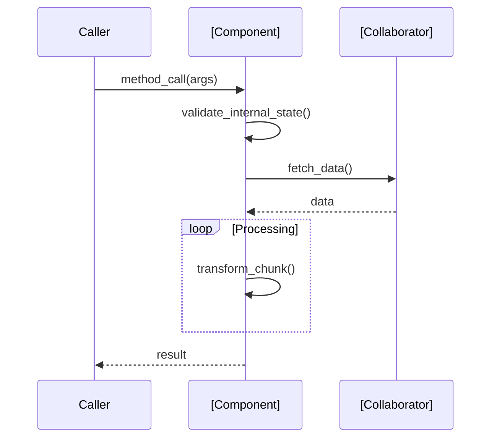

# MINI-SPEC: Behavioral Anchoring

> **Purpose:** To prevent "Unanchored Code" by defining the internal behavior (Design) of a component before the Type Signature (Contract) is written.

## 1. The Macro / Meso / Micro Hierarchy
1.  **Macro (Strategic):**
    *   **Specs (PRD):** What the user wants.
    *   **Design (Mini-Spec):** How the system behaves (CRC + Sequences).
        **<-- YOU ARE HERE (Design layer)**
    *   **Contracts (.pyi):** Structural interface definitions.
2.  **Meso (Session):** Scoped execution boundary (`execution-handoff-bundle.md`).
3.  **Micro (Execution):** Tasks (`tasks.json`) and Implementation (`.py` files).

## 2. CRC Card Standard
Class-Responsibility-Collaboration (CRC) cards map the component's internal soul.

**Format:**
```text
### [Component Name]
**Responsibilities (CRC):**
* **Primary Goal:** [One sentence summary]
* **State:** [Stateless | Stateful (describe persistence)]
* **Collaborators (Dependency Injection):**
    * [Collaborator 1]: [Injected via `__init__`]
    * [Collaborator 2]: [Injected via method arg]
    > **Rule:** Do NOT instantiate these inside the class. Receive them as arguments.
* **Key Responsibilities:**
    1.  [Behavior 1] (e.g., "Validates input schema against X")
    2.  [Behavior 2] (e.g., "Transform data using Y strategy")
    3.  [Behavior 3] (e.g., "Emit audit metric Z")
```

**Heuristics:**
* **No Implementation Details:** Do not mention specific libraries (e.g., "pandas") unless they are structural constraints. Focus on the *flow*.
* **One Card, One Concept:** If a card has >7 responsibilities, break it down.
* **Traceability:** Every responsibility listed here MUST eventually map to a method in the `.pyi` interface.
* **No Private Methods:** `_`-prefixed methods are internal implementation details and must NEVER appear in Key Responsibilities. Only public-facing behaviors belong in a CRC card.

## 3. Sequence Diagram Standard
Use Mermaid to lock down the critical execution path, specifically side effects and external calls.

**Format:**


**Heuristics:**
* **Happy Path + 1 Edge Case:** Diagram the primary success flow and the most critical failure mode (e.g., Stale Data).
* **Explicit Data Flow:** Show what data moves between participants.

## 4. Gap Analysis Rules
When auditing Code vs. Design:
1.  **Unanchored Code:** If the implementation code (at the path defined in `project-spec.md`) contains logic NOT in the CRC, it is "Unanchored."
    -> **Action:** Add to Design OR Remove from Code.
    > **[HARD] Exemption:** Private methods (`_`-prefixed) in the implementation are exempt. Filter them out before comparison. Do not flag as "Unanchored Code."
2.  **Missing Implementation:** If CRC lists a Responsibility NOT in the implementation code, it is "Missing."
    -> **Action:** Implement it.