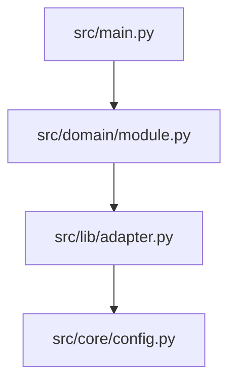
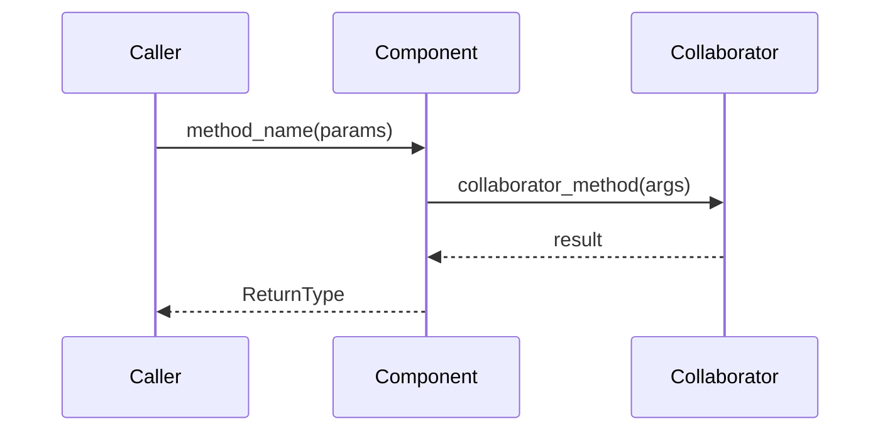

# System Architecture Specification

**Approved:** False

## 1. Foundation Layer Definitions

### 1.1 Configuration Schema
[Define the core configuration models (e.g., Pydantic BaseSettings) required to bootstrap the environment. List environment variables and default bounds.]

### 1.2 Domain Primitives
[Define the foundational data structures, TypeAliases, Enums, and base Pydantic models that will flow across multiple system boundaries.]

## 2. Architecture Layer Mapping
[This project enforces a strict `src` layout. All components must map to the following boundaries.]

* **Layer 1 (Foundation):** `src/core/` (Configuration, Constants, Global Types)
* **Layer 2 (Utility):** `src/lib/` (Stateless clients, database adapters, external integration helpers)
* **Layer 3 (Domain):** `src/domain/` (Core business logic, orchestrators, internal routers)
* **Layer 4 (Entrypoint):** `src/main.py` or `src/jobs/` (CLI commands, API endpoints, job runners)

## 3. Interface Registry
[A mapping of every structural component to its corresponding protocol contract and implementation path.]

| Component Name | Protocol Contract | Target Implementation Path |
| :--- | :--- | :--- |
| [e.g., Inference Router] | `interfaces/inference.pyi` | `src/domain/inference_router.py` |
| [e.g., State Store] | `interfaces/storage.pyi` | `src/lib/redis_adapter.py` |

## 4. System Dependency Graph
[A Mermaid diagram illustrating the data flow and strict dependency directionality between the registered components.]

## 5. Component Specifications
[Populated by `/io-architect`. One subsection per registered component.]

### [ComponentName]
**Layer:** [1-Foundation | 2-Utility | 3-Domain | 4-Entrypoint]
**File:** `src/[path]/[module].py`
**Protocol:** `interfaces/[protocol].pyi`

**Responsibilities:**
- [Observable behavior — maps to at least one Protocol method]
- [Each responsibility is testable in isolation]

**Collaborators:**
- [ComponentName] via [ProtocolName] — [why needed]

**Must NOT:**
- [Explicit negative constraint — what this component must never do]

**Sequence Diagram** (non-trivial flows only):
