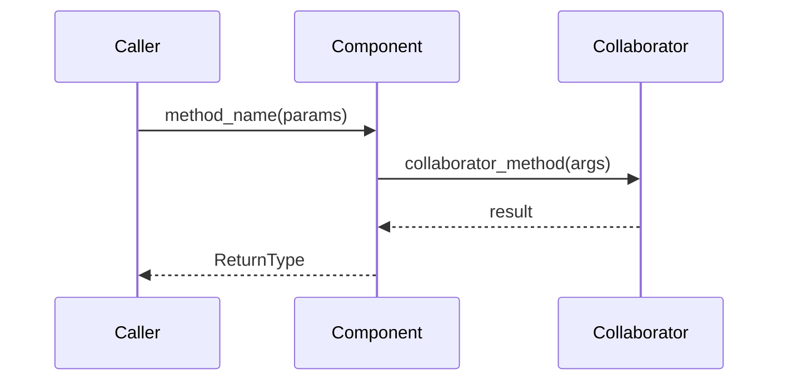

# MINI-SPEC: Behavioral Anchoring

> **Purpose:** To prevent "Unanchored Code" by defining the internal behavior (Design) of a component before the component contract (Contract) is written.

## 1. Position in the Workflow

```
PRD -> /io-clarify -> /io-specify -> [/io-architect uses mini-spec] -> /io-checkpoint -> /io-plan-batch -> /validate-tasks -> dispatch-agents.sh
```

This skill is invoked by `/io-architect` during the CRC card and contract design steps. It defines what a component does (Design) before the component contract is written (Contract).

## 2. CRC Card Standard

Class-Responsibility-Collaboration (CRC) cards map the observable behavior of a component.

**Format:**

```markdown
### [ComponentName]
**Layer:** [1-Foundation | 2-Utility | 3-Domain | 4-Entrypoint]
**File:** `src/[path]/[module].py`

**Responsibilities:**
- [Each responsibility is a testable behavioral statement]

**Collaborators:**
- [ComponentName] via [ContractName] — [why needed]

**Must NOT:**
- [Explicit negative constraint — what this component must never do]
```

**Source of truth:** CRC behavioral data (responsibilities,
must_not) lives in `plans/component-contracts.yaml`. The CRC
Cards section of `project-spec.md` is rendered from the YAML
by `render_crc.py`. Do not hand-edit the CRC section -- modify
the YAML and re-render.

This format definition describes the RENDERED output, not a
hand-authored input.

**Heuristics:**

- **Observable behaviors only:** Responsibilities describe outcomes, not implementation steps. "Validates payload against domain model" not "calls `.model_validate()` on input dict".
- **One card, one concept:** If a card has more than 7 responsibilities, break it into two components.
- **Traceability:** Every responsibility must map to at least one entry in the component contract's `methods` list. Private helpers (`_`-prefixed) do not appear in CRC cards.
- **Must NOT is mandatory for behavioral components:** Derive
  from layer rules in `pyproject.toml` import-linter config.
  Leaf components (no contract, no collaborators) are exempt
  -- their constraints are implicit in their layer placement.
- **Testable, not tagged:** Every responsibility is a testable
  behavioral statement. No implementation status tags or file
  citations -- those are tracked by the backlog and codebase.

## 3. Sequence Diagram Standard

Use Mermaid to lock down the critical execution path — side effects, external calls, and error branches.

**Format:**



**Heuristics:**

- **Happy path + primary failure mode:** Always diagram the success flow. Add a failure branch if the error responsibility is non-obvious (e.g., who raises `UserNotFoundError` when the repo returns `None`).
- **Show data at boundaries:** Label arrows with the type or shape of data crossing each seam — not variable names.
- **Non-trivial flows only:** Simple pass-through components do not need a sequence diagram.

## 4. Gap Analysis Rules

When auditing code against design:

1. **Unanchored Code:** Implementation contains logic NOT in the CRC.
   - Action: Add the behavior to the CRC, or remove it from the code.
   - Exemption: `_`-prefixed methods are internal implementation details. Do not flag them.

2. **Missing Implementation:** CRC lists a responsibility NOT in the implementation.
   - Action: Implement it.
