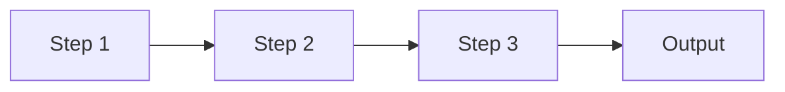
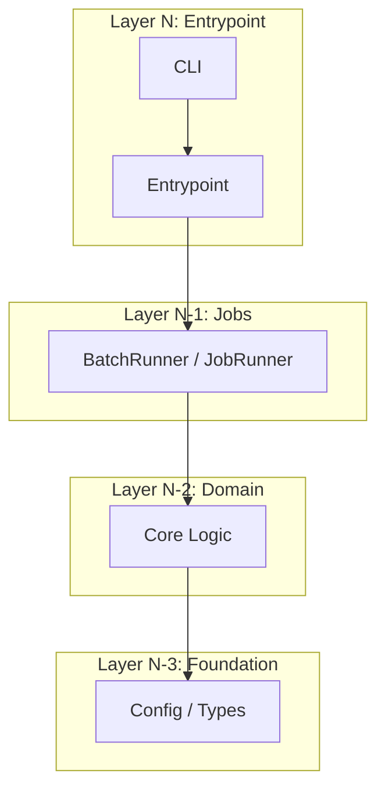

# Architectural Walkthrough Template
<!--
PURPOSE: Generate a deep, evaluator-facing architectural summary of a service.
AUDIENCE: Technical evaluators, investors, senior engineers assessing production readiness.
OUTPUT: docs/current-state-walkthrough.md

This template is NOT for agent onboarding (use templates/current-state.md for that).
This produces a rich narrative document with code references, Mermaid diagrams, and
configuration details suitable for external review.

USAGE: Invoked by the /walkthrough-sync workflow.
-->

> **Audience:** Technical evaluators assessing production readiness and competitive positioning.
> **Sources:** [PRD.md](file:///REPO_ROOT/plans/PRD.md), source code under `src/`, [settings.yaml](file:///REPO_ROOT/settings.yaml), component contracts in `plans/component-contracts.yaml`, and supplementary docs in `docs/`.

---

## 1. Core Algorithm / Decision Logic
<!-- SOURCE: plans/PRD.md (algorithmic sections), src/models/ -->
<!-- INSTRUCTIONS:
  - Describe the fundamental algorithm or decision-making approach
  - Include a table of model types / variants with their configurations
  - Reference specific code files with file:/// URIs and line ranges
  - If there's a routing / selection mechanism, explain the decision logic with pseudocode
  - Link to the config dataclass that parameterizes the algorithm (e.g., src/core/config.py)
-->

[GENERATED CONTENT]

---

## 2. Data Flow / Pipeline Architecture
<!-- SOURCE: plans/PRD.md (I/O / pipeline sections), src/jobs/, src/models/orchestrator.py -->
<!-- INSTRUCTIONS:
  - Describe the end-to-end data flow (input -> processing -> output)
  - Include a Mermaid sequence or flow diagram showing the pipeline stages
  - If the pipeline is multi-step/sequential, explain how outputs feed into next stages
  - Reference the orchestrator or pipeline runner with code links
  - Explain any data augmentation or feature engineering that happens between steps
-->

<!-- Replace with actual pipeline diagram -->

[GENERATED CONTENT]

---

## 3. Domain-Specific Innovation
<!-- SOURCE: plans/PRD.md (specialized architecture sections), src/models/ -->
<!-- INSTRUCTIONS:
  - Describe what makes this system architecturally unique vs. naive approaches
  - This is the "competitive edge" section -- what does this system do that others don't?
  - Include concrete examples of how the architecture handles edge cases
  - Reference the specific implementations with code links
  - If applicable, explain cold-start handling, generalization, or transfer learning patterns
-->

[GENERATED CONTENT]

---

## 4. Operational Guardrails
<!-- SOURCE: settings.yaml, src/lib/constraints/, src/lib/io/ -->
<!-- INSTRUCTIONS:
  - Hard business rules / constraint engines
  - Fallback mechanisms (what happens when the ML model fails?)
  - Staleness gates / data freshness enforcement
  - Safety caps / memory limits
  - Include a table of constraint types with examples from config files
-->

[GENERATED CONTENT]

---

## 5. Data Contract
<!-- SOURCE: plans/PRD.md (data requirements), src/lib/io/, src/jobs/batch_runner.py -->
<!-- INSTRUCTIONS:
  - Input schema (what data does the system consume?)
  - Output schema (what does it produce?)
  - Data quality requirements (validation, freshness, completeness)
  - The feedback loop: how do outputs eventually become training inputs?
  - Include a diagram showing the data lifecycle if applicable
-->

<!-- manual -->
<!-- Content below this marker is preserved during regeneration -->
[MANUAL CONTENT -- competitive positioning, nuanced explanations]
<!-- /manual -->

[GENERATED CONTENT]

---

## 6. Configuration & Deployment
<!-- SOURCE: settings.yaml, Dockerfile, docker-compose.yml, src/jobs/entrypoint.py -->
<!-- INSTRUCTIONS:
  - Key configuration knobs and their effects
  - Deployment architecture (container, CLI, cloud backends)
  - Environment detection and path resolution
  - Only include settings that an evaluator would care about (skip internal tuning params)
-->

[GENERATED CONTENT]

---

## 7. System Architecture Diagram
<!-- SOURCE: plans/project-spec.md (Interface Registry), .claude/scripts/extract_structure.py -->
<!-- INSTRUCTIONS:
  - Generate a Mermaid diagram showing the layer hierarchy and component relationships
  - Group components by architectural layer
  - Show data flow arrows between components
  - Reference the interface registry for component names and their implementations
-->

<!-- Replace with actual architecture diagram -->